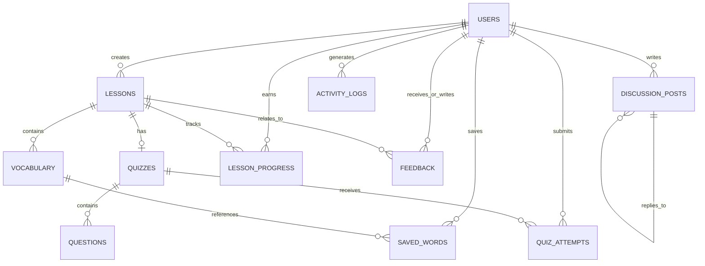

# Lexora ER diagram
Paste this Mermaid into a Mermaid-compatible Markdown preview or recreate it in draw.io.

```mermaid
erDiagram
 USERS ||--o{ LESSONS : creates
 LESSONS ||--o{ VOCABULARY : contains
 LESSONS ||--o| QUIZZES : has
 QUIZZES ||--o{ QUESTIONS : contains
 USERS ||--o{ LESSON_PROGRESS : earns
 LESSONS ||--o{ LESSON_PROGRESS : tracks
 USERS ||--o{ QUIZ_ATTEMPTS : submits
 QUIZZES ||--o{ QUIZ_ATTEMPTS : receives
 USERS ||--o{ SAVED_WORDS : saves
 VOCABULARY ||--o{ SAVED_WORDS : references
 USERS ||--o{ FEEDBACK : receives_or_writes
 LESSONS ||--o{ FEEDBACK : relates_to
 USERS ||--o{ DISCUSSION_POSTS : writes
 DISCUSSION_POSTS ||--o{ DISCUSSION_POSTS : replies_to
 USERS ||--o{ ACTIVITY_LOGS : generates
```
